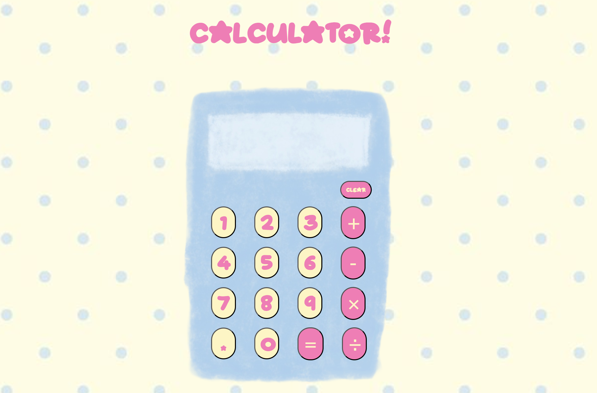

# OdinCalculator
This project is to practice everything I've learned in the TOP foundations program ꉂ(˵˃ ᗜ ˂˵) 

🔗 **[Click here to view!](https://acesavvy101.github.io/OdinCalculator/)**

## Desktop View:

---

## New things I learned from this project:
  - State management
  - Flow Control
  - DOM Events
  - Overall, this is an accumulation of everything I've learned so far in TOP foundations.

## Future Enhancements:
- Add keyboard support!
- Add a backspace button

## Disclaimer:
The wallpaper image used in this project is sourced from Pinterest and are the property of their respective owners. This project is non commercial and intended for personal/educational use only. (The Calculator is hand drawn by me ٩(ˊᗜˋ*)و)